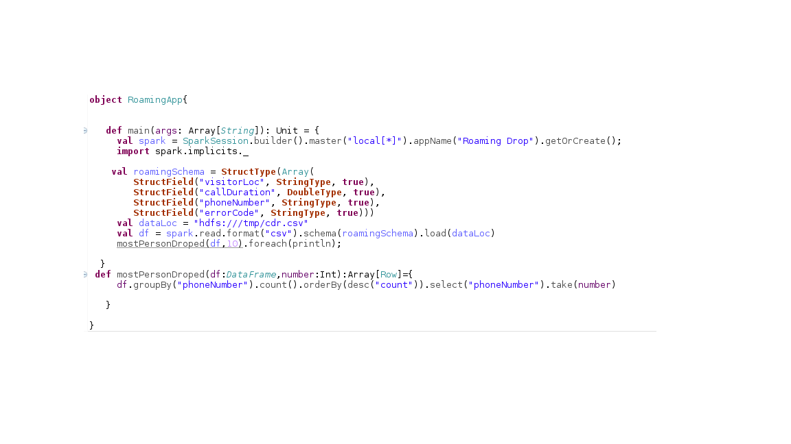
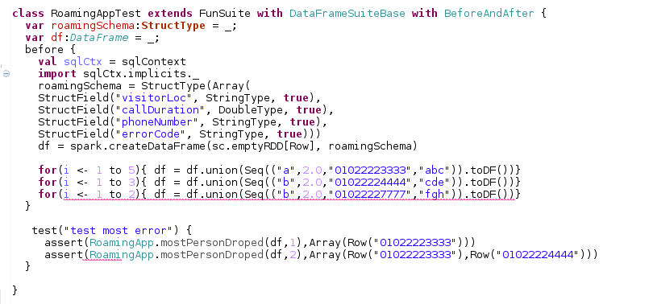
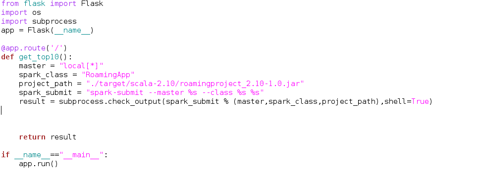
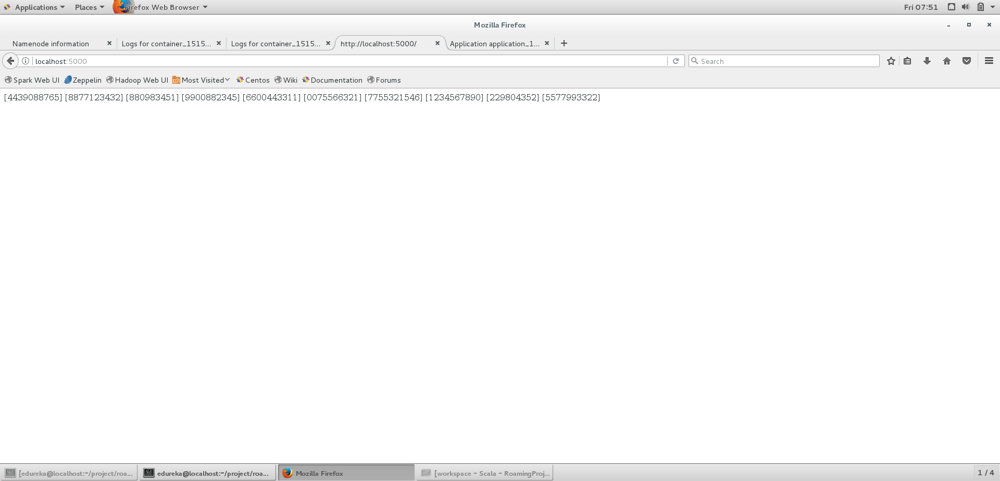

#Creating flask api with spark app created by scala.
---
In this project simple flask api which retrieve most called dropped from tdr.csv data stored in Hadoop Distributed File System (HDFS).
cdr.csv consists of columns.

| VISITOR_LOCN  |CALL_DURATIon(SEC)|PHONE_NO|ERROR_CODE|
|---|---|---|---|---|

---

The goals / steps of this project are the following:

* Create spark app with scala to find out find out top 10 customer by their phone number.
* Create unit test to test the spark application.
* Make simple web api by running spark app.
---

### Create spark app.
* RoamingApp object with mostPersonDroped and main have been created.

---

### Make unit test.
* The test to check the  mostPersonDroped method.
* external package of [holdenkarau]( https://github.com/holdenk/spark-testing-base) has been used to make unittest.

---

### Create Api.
* Simple flask api to run spark app.
* This gave us the phone number of people whose call have been dropped.  

